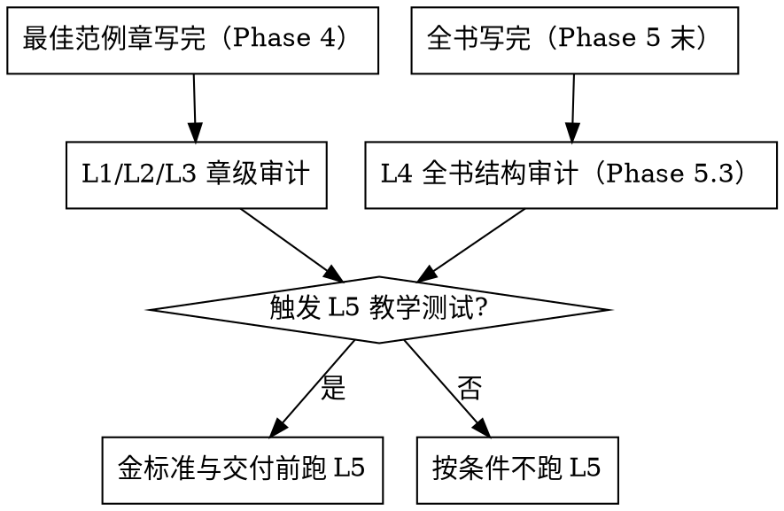

# 审校与教学测试

> **本文件是 SKILL.md Iron Law 2（先写金标准再并行铺章）的执行细则**：
>
> - §七 最佳范例章门槛 + §八 回填约束文件 = Iron Law 2 的卡关——最佳范例章通过四层审计 + 试教（条件触发，L1-L4 + L5）并回填 style-spec 前，禁止启动 Phase 5 并行。
> - Iron Law 1（设计先行）的定稿判据在 `file-contracts.md`（Phase 3 四文件契约 + 三关），不在本文件。
> 违反 = 返工，不存在"边并行边补审"的灰色通道。

## 九、subagent prompt 必带要素

> **位置说明**：运行时会把方法论文档截到 9000 字符；本节连同工具纪律前置到这里，是为了让末尾的平台无关规则完整进入交办说明。编号保留既有引用契约，不按出现顺序重排。
>
> **按需回读**：交办摘录不包含文档尾部全文。涉及约束回填/三轮审计时回读 §八、§十；涉及小助手中途引导/暂停收回时回读 §十一、§十二。不要从截断副本臆测缺失段落。

> 写作 subagent 的完整派发模板见 `subagent-prompts/writing-agent-prompt.md`（单一事实源，改契约改那里、别改两处）；本节只列必带要素，与模板同步。审计 subagent 见 `subagent-prompts/audit-agent-prompt.md`（普通章）与 `subagent-prompts/gold-audit-prompt.md`（金标准章）。

Phase 5 并行铺章时，每个 writing subagent 的 prompt 必带：

1. 金标准章全文（作为范例）
2. 写作规范 + 章节骨架 + 源材料索引三件产物全文（skill 侧＝`META.md`＋`style-spec.md`＋`OUTLINE.md`＋`源材料索引.md`；本仓＝`work/style-spec.md`＋`work/outline.md`＋`work/explore.md`＋`work/knowledge-map.json`——**按你项目里实际存在的文件派**）
3. 本章的具体源材料映射（源材料索引里本章的那一节，精确到行号）
4. 防幻觉铁律完整 4 条（见 §6.4）
5. 不变量底线（从 invariants.md 读适用路线的 I/H 编号）
6. 本章在知识链中的位置和跨章引用指向
7. 本章深度承诺 + 四维自问（style-spec §深度四维承诺表，逐个过 `references/depth.md` 判定问题，自问结果写进完工回报）
8. 本章知识点清单（outline 里本章的 points，写完逐条打钩）+ 前向引用粒度规则（只到大纲承诺粒度，禁止编造未写章节的具体数字/结论/例题）
9. **工具纪律**（跨平台，见下方「工具纪律 · 单一事实源」）：文件 I/O 用文件工具（read / write / edit / glob / grep），shell 只留给真需要 shell 的场景且用前说明理由；措辞不点名单一 shell 名，Windows 与 macOS/Linux 同一条规则。

### 工具纪律 · 单一事实源（prompt 模板引用这里，别各处各写一份）

> 用词约定：下面说「shell 工具」一律指**你所在平台的那个**——Windows 是 pwsh，macOS / Linux 是 bash。规则对两边完全一致，不因平台不同而改变行为，也不因平台不同而绕道。写作/审计 subagent 模板与主 AI 交办说明都引用本节，禁止在别处另写一份纪律。

1. **读文件用 read 工具，不用 shell**：看文件内容必须用 `read`（带行号、可分页、UTF-8 确定）。禁止用 shell 读文件（pwsh 的 `Get-Content` / `cat` / `type`，bash 的 `cat` / `head` / `tail` / `less` 等）。
2. **写/改文件用 write / edit 工具，不用 shell**：新建或整体替换用 `write`；局部修改先 `read` 旧版本再用 `edit`。禁止用 shell 写文件（重定向 `>` / `>>`、`Set-Content`、`Out-File`、`echo … >`、`sed -i` 等）。
3. **找文件 / 搜内容用 glob / grep 工具，不用 shell**：按路径模式找文件用 `glob`；在文件内容里搜匹配行用 `grep`（拿行号后要上下文再用 `read` 打开）。禁止用 shell 做搜索（`find`、`ls` 列目录、`rg`、`Select-String`）。
4. **shell 只留给 fs 工具覆盖不了的真场景**：`read` / `write` / `edit` / `glob` / `grep` 之外、确实需要 shell 时才用 shell 工具——例如 git 操作、npm / npx、node 与构建脚本、启动本地服务、调用其他可执行文件。每次 shell 调用前先用一句话说明「为什么必须用 shell」。
5. **禁止用 shell 直连工作台本地 API**：工作台的接口数据由主 agent 经任务说明提供，子代理禁止用 `Invoke-RestMethod` / `curl` / `wget` 直连本地 HTTP 接口。
6. **文件 I/O 一律平台无关**：不因为当前平台是 Windows 就用 pwsh 做文件操作（bash 同理，不因为 macOS/Linux 就用 bash 做文件操作）。工具纪律不随平台变。

---

## 蓝军审校（对抗性审校）

**同一模型不同 prompt 角色的对抗**：写作 agent 以"生成流畅内容"为目标，审计 agent 以"证伪具体主张"为目标。**永远不要让写作 agent 审计自己。**

### 四层审计 + 试教（条件触发）

| 层 | 检查什么 | 判据 | 何时、对什么对象跑 |
| --- | --- | --- | --- |
| **L1 事前规则** | 是否遵守写作规范（按 style-spec 板块语法齐全 / 非对话体 / 禁用词 / 先推导后命名） | 违规条数 | **每个章写完即跑**（Phase 4 金标准、Phase 5 每个并行章各自跑一次） |
| **L2 敏感对齐** | 敏感领域表述是否越界 | 越界 = 整本作废 | **每个章写完即跑**（同 L1，敏感学科尤其），最后全书再扫一遍 |
| **L3 引文抽检** | 随机抽 10 条具名引用，独立回忆判真伪 | phantom（编造）= 该节重写 | **金标准（Phase 4）必跑；Phase 5 每章抽检**；有源场景回源材料索引核对行号 |
| **L4 结构** | 覆盖度、权重、闭环、跨章风格一致性 | STRONG / ADEQUATE / WEAK | **全书写完后跑（并入 Phase 5.3 跨章审计）**——它天然是跨章视角 |
| **试教（L5 教学测试，条件触发）** | 喂 AI 老师教模拟用户 20-30 轮对话 | AI 老师不卡住/不编造/不答非所问 | **金标准定型时（Phase 4）条件触发跑一次**；交付前（Phase 6）对全书再条件触发跑一次 |

> **一句话记忆**：L1/L2/L3 是**章级**审计，跟着每个章走（写一章审一章，别攒到最后）；L4 是**全书级**结构审计，并入 Phase 5.3；L5 是**教学级**实测（**条件触发**：金标准定型时和交付前各跑一次，非每章必跑）。所有审计都遵守"独立闭环 + 核实后改"（见 §六）。



## 试教（条件触发 · L5 教学测试，最关键）

**L5 最能暴露"看起来像样其实教不出去"的蓝本。**

**测什么**：拿蓝本 + 教学指令喂给一个上下文干净的"AI 老师"（只给蓝本，不带任何造书推理），让一个"学生"（不预习、有典型误区）与之跑 20-30 轮对话。观察：

- AI 老师能不能用 🎬 场景切入？
- 能不能照 💬 提问路线图引导？
- 学生答偏时能不能用 📌 知识锚定拉回来？
- AI 老师**卡住**吗？**编造**吗？**答非所问**吗？
- 学生**真的抵达知识锚点**了吗？

**怎么测——三条路径，成本/独立性不同，让用户选一条**：

| 路径 | 独立性 | 成本 | 何时选 |
| --- | --- | --- | --- |
| **A · Claude 自测**（落盘文件 + 交替 subagent） | 中（同模型自演） | 低、零外部依赖 | 想快速自查、无外部工具时 |
| **B · socratic-lens 外部工具** | 高（独立项目专测） | 中（需装/跑另一个项目） | 要正式验收、有条件跑外部工具 |
| **C · 真人测试** | 最高 | 高（需真人陪跑） | 交付前最终把关、样本蓝本 |

> ⚠️ **不要在单个 agent 的脑内左右互搏地"写一段师生对话"**——老师和学生共享同一上下文，学生的"误区"是老师脑补出来的，测不出真实盲区，没有独立性价值。必须让"老师"上下文干净。

**路径 A 的做法（Claude Code 内闭环）**：Claude Code 的 subagent 之间**不能直接对话**（各自返回一条 final message 就结束），所以用**落盘文件当对话通道**，由主 agent 编排交替：

1. 建一个 `L5-dialogue.md` 作对话记录。
2. **学生 subagent**：读 `L5-dialogue.md` 当前对话历史 → 以"不预习、带典型误区的学生"身份追加**一轮**发言 → 返回。
3. **老师 subagent**：**只给它蓝本 + `L5-dialogue.md`**（不给造书上下文、不给源材料、不给章节骨架）→ 按蓝本的 💬 提问路线图追加**一轮**回应 → 返回。
4. 主 agent 交替 spawn 二者，跑 20-30 轮，全程记进 `L5-dialogue.md`。
5. **分批与续跑**：轮次可分批（如每批 5-8 轮），`L5-dialogue.md` 落盘即续跑依据——被打断后从当前轮继续，不重头来；上下文预算不足时优先分批/外部化记账，**不降级成脑内自演**。
6. 跑完后，主 agent（或一个独立审计 subagent）通读 `L5-dialogue.md`，对照上面"观察"清单判读，产出结论。

> 老师 subagent 每轮都必须是**干净上下文**——这是路径 A 独立性的唯一来源。它只能看到蓝本和对话历史，不能看到"这本书是怎么造的"。

**路径 B 的做法**：把蓝本喂给 [socratic-lens](https://github.com/xx-hub/socratic-lens) 项目，它专门检验"AI 老师是否真能沿主线教学、不跑题、不幻觉"，独立性高于同模型自测。

**金标准节必须扛住 L5 教学测试，才把它塞进后续所有 writing agent 的必读列表。**

## 幻觉 gate（贯穿写作全程）

每个 writing agent 的 prompt 里都要包含这条自我约束：

> **每写一条具名引用/数字/日期前，问自己"我愿意打赌这是真的吗？"——有一丝犹豫就降级为间接转述。**

审计是终检，**写作时的自我 gate 才是主战场**。完整 4 条铁律与执行细节见 §六·6.4。

## 选题前：知识密度 + 深度可达自评（Mode A 尤其重要）

选题前过两道 gate（详见 `source-material.md` §四）：① 知识密度——AI 就 20 个核心锚点各写一段，有明显犹豫或错误就换题；② 深度可达——对最核心的 3 个概念各写一段"给内行看的 200 字讲解"，用 `references/depth.md` 判定问题评估，三个样张都停在"是什么"级则建议找源或换领域。两道 gate 齐备才放行。古典音乐/教材/哲学/数学效果好；流行文化/版权敏感领域幻觉严重。

## 跨章审计（Phase 5.3）

1. 章节骨架的跨章关联表（skill 侧 `OUTLINE.md`、本仓 `work/outline.md`）↔ 各章 🔗 板块一致
2. 单元顺序引用正确（师生合版注意版本差异——如某教材教师用书与学生用书单元顺序相反）
3. 知识递进链没被打断——后一单元依赖的前置概念确实在前面讲过（示例：英语语法链"代词 → 一般现在时 → 名词所有格 → 频度副词 → 一般将来时 → 现在进行时"；数学"分数 → 比例 → 一次方程"；历史"分封制 → 郡县制 → 中央集权"）
4. 追加内容无矛盾（坑型编号 P1/P2/... 不撞车）
5. 深度一致性：各章深度与 style-spec 承诺一致，不能前几章深后几章浅（并行铺章 drift 的常见形态）

## 六、高级审计纪律：独立闭环与冲突源裁决

### 6.1 独立审计的"上下文干净"原则

审计员应**不知道建造时的推理**——同一个对话 session 里"自审"会不自觉地为自己的选择辩护。正确做法：**审计 agent 从零读取当前产出文件 + 权威源，不看建造日志。** 金标准章、基础设施文件（写作规范/章节骨架/索引）、附录——每个重要产出物都应过一次独立审计才定型。

**红旗自检**（正在想这些 → STOP）："我自审两遍了，不用再起 subagent" / "我就是最懂这章的人" / "让同事扫一眼就算独立审计了" / "自审通过写进报告，流程就闭环了"。借口真相见 `anti-patterns.md` ③。

> **协调员「先派、后读、再合」——派发时一章正文都不许读（硬约束，不做例外）。** 统筹多个审计对象的那个人（**协调员**：可能是主 agent，也可能是被派去审一批章节、准备再往下分的审计 agent 自己）**先把任务派下去，只收下级审计员交回的报告，再逐条合并**；**派发那一刻它手里一章正文都不许有**。理由就是本节这条病——审计判据是事实核对，协调员一旦先读了书，它报的"我核过了"就不可信了，**再往下嵌套派工不但没帮上忙，还会让这一路审计全部继承同一份污染**。下级审计员怎么派见 `subagent-prompts/audit-agent-prompt.md` 顶部。
>
> ⚠️ 派工用平台的 subagent 调度工具，**不许改用打断重来那套**（`interrupt_agent` 是「暂停后收回小助手」专用的，§十二），也不许让子代理读协调员自己的上下文。

> **用会"读完再下结论"的 agent 类型跑审计，不要用偏短探索/搜索的类型。** 后者反复出现在读完若干文件后中途返回一句"我去核对"就结束、不产出完整报告的情况；长篇报告的汇编和审计同理。审计 prompt 里显式要求"完整报告在最终消息里返回、不要中途停"。

### 6.2 "核实后才改"的铁律

审计员也会误判或误读。审计发现问题**多半准**，但修法**要对齐权威源（原文/方案设计）**，不能照单全收。流程：

```
审计报告 → 逐条回权威源核实 → 确认属实 → 改动
                            → 误判 → 保留不动，注明否决原因
```

> **修法的最终依据是权威源/方案设计，不是审计员的建议。**

### 6.3 多源冲突时的裁决规则

当多份源材料对同一概念给出不同说法时：

1. 以**权威层级最高**的源为准（根真相源 > 教学讲义 > 碎片笔记）
   > ⚠️ **这一条是次级判据，不是主判据**（票 23/25 裁决，别再把它当第一顺位用）。
   > **主判据是按问题类型的四路分派**——先问「这是定义/原则问题、操作步骤问题、考试覆盖范围问题、还是敏捷问题」，
   > 四个问题各有一条权威源（PMBOK7／过程组／ECO 考纲／Scrum 指南），
   > 判据全文与四路的逐条写法见 `patterns/structure/multi-source-arbitration.md`「三源冲突时的表述范式」。
   > **上面这条线性刻度只在四路分派之后、且四路分不出来时才用**：同一个问题类型内、两份教材说法不同
   > （「两个过程组对同一个 ITTO 写法不一致」——这才是这条刻度的主场）。
   > ⚠️ **考纲不进这条线性刻度**：它是**覆盖校验基准**，与「事实真相源」是两种性质的权威，
   > 由四路分派的第 3 路单列；把它塞进「根真相源 > 教学讲义 > 碎片笔记」那一档，是两种权威被混为一谈。
2. 站队后在正文加一句注解说明差异，不假装无冲突
3. 同步修订依赖该源的其他索引文件，不一致会引写作 agent 到错误位置

### 6.4 防幻觉铁律（对齐不变量 I2）

以下 4 条取代上方的简短幻觉 gate 备注，写进写作规范（skill 侧 `META.md`、本仓 `work/style-spec.md`），每个 writing agent 必读：

1. **打赌测试**：每写一条具名引用 / 数字 / 定义 / 公式 / 分类名称 / 偏好判断（"PMI 首选 X""应当 Y"）前，问自己"愿不愿打赌这是真的？"有一丝犹豫就回源材料索引核对到源文件+行号，或回已声明的判断根（原则/模型/准则条款）。
2. **追不到源就降级**：核对不到的，降级为间接转述（"通常认为…"）或干脆不写。**绝不杜撰**准则定义、过程编号、公式、偏好断言。
3. **最危险条目逐字回源**：考试/技能/条款类教材的公式、框架名称、分类名称最危险——写前必须回材料逐字核对，凭记忆写大概率出错。
4. **偏好断言必标判断根**（对齐 I2）：当书里有"在 X 情境下首选 Y""应当 Z"这类判断，每条必须标注判断依据出处（回哪条原则/绩效域/准则条款）。标不出依据的偏好断言宁可不写。PMP 的"PMI 会怎么选"板块（why-not+判断依据）是标准做法。

Mode A（无源）替代机制：每个断言必须通过 L5 路径 B/C 的学员验证，强制不接受路径 A 自测。

> 审计是终检，**写作时的自我 gate 才是主战场。**

---

## 七、最佳范例章门槛清单（Phase 4 判据）
>
> **Iron Law 2 gate**：金标准章必须同时满足 §7.0 独立 subagent 审计 + §7.1-7.6 六条门槛（含 L5 教学测试与深度承诺兑现）+ §八 回填约束文件，才算"通过"。**未过 = 禁止启动 Phase 5 的 subagent 并行铺章**——这是 SKILL.md Iron Law 2 的硬卡关，不靠"我觉得差不多"过关。

金标准章必须同时满足以下门槛才"通过"，否则回炉：

### 7.0 金标准章的独立 subagent 审计（先跑这个，再跑下面 6 条）

写完金标准章后，**必须派一个独立 subagent 做结构化审计**——用你所在平台的 subagent 调度工具，按 `auditor-prompt-template.md` 模板 B 机械填占位符派发；金标准章的干净一致性审计按 `subagent-prompts/gold-audit-prompt.md` 派（必读文档矩阵 + 一致性核对，产出含 matrix 的 `work/audit-<NN>.md`，机器会逐条 string-match 核对 quote）；不允许自己代审。它从零读取约束文件 + 章正文，不带任何造书上下文。审计项：

1. **对照写作规范**：Voice 规则、本书定位、防幻觉铁律、读者意识声明、章内板块语法、章末教学区规范、写作纪律、frontmatter schema、AI 老师使用方式、防螺旋铁律、脚手架标题列表、**多源同级声明**、版权铁律、字数——逐条打钩，重点核章内板块语法与写作纪律（skill 侧对照 `META.md`，本仓对照 `work/style-spec.md`）
2. **对照章节骨架**：标题匹配、核心问题是否全部回答、该章列出的覆盖目标（考纲任务/课标/知识域等）是否完整兑现、判断根锚定列是否在正文中有显式回扣（skill 侧对照 `OUTLINE.md`，本仓对照 `work/outline.md`）
3. **对照源材料索引**：预抽关键条目是否全部覆盖（不是一笔带过）、硬记锚有无遗漏、高频陷阱是否被提及（skill 侧对照 `源材料索引.md`，本仓对照 `work/knowledge-map.json`）
4. **"说清楚了吗"测试**：一个完全没学过该领域的读者，读完能自己说清楚本章标题承诺的三个核心概念吗？哪些被提到但没展开（读者会"这就完了？"）？
5. **贯穿案例一致性**：案例场景是否具体可触摸？概念是否自然从案例事件引出？
6. **自测题质量**：是否全部原创？跨行业覆盖 ≥ 3？每题解析是否说清了"为什么对、为什么错"？
7. **深度四维审计**：对照 style-spec §深度四维承诺，对本章核心概念用 `references/depth.md` 的判定问题逐维核对——该维承诺"中/深"是否兑现？"浅"是否有已确认的理由？判"兑现/未兑现"；每个核心概念至少一个维度真正达到承诺深度，不能全书停在"是什么"级

审计 subagent 产出结构化报告（格式见 `auditor-prompt-template.md`）——每条结论 ✅/⚠️/❌ + 修改建议优先级（P0 必改 / P1 应改 / P2 可改）。

> **为什么必须是独立 subagent**：写金标准的 agent 已经"沉浸"在自己的推导逻辑里，看不出叙事断弧和覆盖缺口。独立审计从零读文件，带着"一个新手读者能不能看懂"的外部视角。

### 7.1-7.6 静态+实测门槛

金标准章必须同时满足以下门槛才"通过"，否则回炉：

1. **板块语法一致**：严格遵守 style-spec 定义的章内板块语法，无遗漏必含板块、无约定外板块
2. **源回溯干净**：随机抽 10 条定义/公式/判断，全部能回源或回判断根（L3 引文抽检）
3. **事实/判断分离**（如选了 fact-vs-judgment 卡）：确定性知识清单里不混入判断类断言
4. **why-not 无附加条件杜撰**（如选了 judgment-card 卡）：候选项排除只靠权威原文明确说过的适用条件
5. **L5 教学测试通过**（条件触发）：20-30 轮对话 AI 老师不卡住、不编造、能带学生抵达锚点
6. **深度承诺兑现**：style-spec 声明的四维深度目标达成，未兑现回炉（判据见 §7.0 第 7 项）

前 4 条与第 6 条是静态门槛，第 5 条是实测门槛（条件触发）。

---

## 八、审计后回填约束文件（防复发机制）

> **金标准审计发现的问题，有一半是章的问题（修章），另一半是约束文件的问题（修写作规范/章节骨架/索引）。如果不回填约束文件，后面每个并行章都会重踩同一批坑。**

**红旗自检**（正在想这些 → STOP）："修章就够了，回填太慢" / "后面并行章我注意着点就行" / "加一句注释就算回填了"。借口真相见 `anti-patterns.md` ⑥。

### 8.1 回填判断：问题是"章没写对"还是"文件没写清楚"？

审计发现一个 gap 时，先问：

- 这个 gap 是**这个 agent 的疏漏**（别的 agent 大概率不会犯）？→ 只修章
- 这个 gap 是**约束文件没写清楚 / 没要求**（别的 agent 大概率也会犯）？→ **修章 + 修约束文件**

实战判例（学科中立，适用任何领域）：

| 审计发现 | 根因 | 回填哪个文件 |
| --------- | ------ | ------------- |
| 正文一句判断根锚定都没有 | 章模板里没有"回扣地基章"的槽位——agent 没被要求写 | **写作规范的章模板**：加"回扣地基章"槽位（写法："这就是[地基章讲过的XX原则/定理/框架]在具体情境中的样子"） |
| 开篇场景提出的困境在章末没有回应 | 章模板没有叙事闭环检查——agent 写完开头忘了结尾 | **写作规范的章模板**：加"开篇困境必须在某一层推导中被解决/回答"的硬规则 |
| 章节骨架中该章列出的核心问题有一条没被回答 | 骨架表的"核心问题"列被 agent 当参考方向，不是硬约束 | **章节骨架表**：在表头前加硬约束——"核心问题列 = 必须回答的问题清单，写完后逐条自检" |
| 某个板块元素全部挤在同一层推导里 | 章模板规定了数量但没说分布规则 | **写作规范的章模板**：加"均匀分布在各推导层，不全堆在一层" |
| 源材料索引预抽的关键条目有一条在正文中完全缺失 | 源材料索引有预抽条目，但 agent 没有被要求逐条核对 | **源材料索引**：在章条目后附加"写作 agent 覆盖自检清单"，写完后逐条打钩 |

> 上表的本质模式：**审计发现某条规则被违反 → 追问"这条规则写在哪？agent 开工前能看到吗？"→ 如果规则不存在或不够硬 → 把规则补进约束文件。** 学科专属术语（PMBOK7/ECO/Ch3 回扣）替换为你的学科对应物即可。

### 8.2 回填时机和流程

```
金标准章写完 → 独立 subagent 审计（§7.0）
  → 审计报告出来
    → P0/P1 项：逐条修章
    → 同时问：每一条的根因在不在约束文件里？
      → 在 → 同步修写作规范 / 章节骨架 / 源材料索引
      → 不在 → 只修章
  → 约束文件修完后，重读一遍确保新规则不自相矛盾
  → 金标准章 + 约束文件双双定稿 → 进入 Phase 5 并行铺章
```

### 8.3 一句话

> **审计不只要修章，还要修"章为什么写错了"。否则每个并行 agent 都会用同样的方式写错。**

---

## 十、三阶段递进审计（成书流程）

一本书从"写完"到"定稿"，要过**三轮**审计，一轮都不能省：

### 第一轮：章级独立审计（跟着写作走）

每写完一章（或每写完一批 2-4 章），用你所在平台的 subagent 调度工具，按 `auditor-prompt-template.md` 模板 A 派一个**上下文干净的独立审计 subagent** 审这一章（审计派发模板见 `subagent-prompts/audit-agent-prompt.md`；金标准章用 `subagent-prompts/gold-audit-prompt.md`）。这一轮对应上面的 L1-L3，重点是**章内问题**：板块齐全、Voice、近逐字版权、预抽条目覆盖、练习/自测题质量。

> ⚠️ **写作 agent 的自审不算审计。** 写作者已经"沉浸"在自己的推导里，会对"这句话其实是源材料的原句""这段我以为讲透了其实跳步了"失明。实战中反复出现：写作 agent 完工时自报"定义都从案例推导、无逐段翻译、版权安全"，独立审计却在同一章查出多处近逐字照搬源材料（含把源文件的图表重制）。**永远另起一个没参与写作的 agent 审。**

### 第二轮：全书结构与索引审计（全书写完后）

> **真实模式落地（2026-08-27，ADR-0007）**：这一轮就是「合并前跨章审计」——主 AI 在机器合并成书**之前**通读全部章 + outline + knowledge-map，按下面的清单核对，结论落盘 `work/audit-cross.md`，机器验该文件存在才放行 `stage-submit merge`（`src/workflow.js` 硬校验）。机器扫描（引用矛盾/章名全书唯一/无重复标题，其中后两条**真拦交付**——ADR-0008 的 2026-09-30 修订：章名读大纲去重、小节标题只拦同一章内重名，跨章同名只提示）与 AI 深度核对分工：机器扫结构、AI 查语义。

所有章 + 附录写完后，起独立审计员做**跨章/全书级**检查（对应 L4）。重点不是单章文采，而是"拼起来对不对"：

- **外部清单与章节的映射表**（考纲/课标/ECO/知识点清单 ↔ 章）——逐条回权威源核对名称、编号、归属章。这类"索引/映射表"是错误高发区：条目整条错位、归属章标反、声称某章覆盖实则查无实据。
- 跨章事实一致性（贯穿案例的数字、人名、设定、计数）
- 时间线与因果顺序（前章说先发生 X，后章不能说先发生 Y）
- 术语统一（同一概念在不同章不能有两个译名/说法）
- 交叉引用不悬空（"见第 X 章"那章真的讲了；附录里的"见卡 X.Y"真的存在）
- 目录/标题与正文一致（复制粘贴残留最容易藏在这里）

> 这一轮的典型现象：**正文本身没硬伤，问题全在"索引/目录/映射表"上**——它们是收尾疲劳期最容易被草率处理、又最先被读者看到的东西。任何"全书-章节-知识点"的对应表，都必须以权威源为唯一真相源逐条重核，不能凭作者记忆。

### 第三轮：修订复审（修完第二轮之后）

> **真实模式落地（2026-09-29，ADR-0027）**：这一轮是「最后检查」——主笔 AI **不自己通读 `work/book.md`**，而是派 5 个上下文干净的小助手分查（协调员派发时一章正文都不许有，§6.1 同一条硬约束），只收 5 份报告、按点名的条目改、汇总交工；机器硬检查（质量门）那一层照旧。**分派口径见下面「终检分查」一节**，下面两条「修复到位」「查新问题」由五路各自查。

第二轮报的问题修完后，**必须再过一遍审计**，目标是两件事：

1. **核实修复真的到位**：声称修了的，逐条回原文确认改对了、改全了（实战中出现过"声称统一了术语，但全书 grep 还有残留"）。
2. **查修订引入的新问题**：改 A 处时容易漏掉 B 处的连锁更新。典型情形——
   - 改了一章里的一个数字/结论，忘了改同章它的图表、正文复述、章末总结、对全书的汇报；
   - 统一了术语，正文改了附录没改；
   - 修了源文件，但合并产物（BOOK.md/导出文件）是旧的，没重跑生成。

这一轮优先用**程序化扫描**处理机器擅长的：叠字/残句、标记配平、表格列数、TODO/占位符、练习题答案与选项映射、内部链接有效性——人在这些上面不如 grep。

### 执行要点（通用，与学科无关）

- **审计用能产出完整报告的 agent 类型**：不要用只做短探索/搜索的 agent 类型跑审计——它们倾向于读几个文件就中途返回、不产出结论。用会"读完再下判断、把完整报告作为最终输出"的类型。prompt 里显式要求"完整报告在最后一条消息里返回、不要中途停"。
- 审计 prompt 必须明确：**只报告、不改文件**；每条结论给证据（文件+行号+原文）；按严重度分级（P0 必改 / P1 应改 / P2 可改）；要求诚实、具体。
- 审计员也会误判（§6.2）——主 agent 要把审计结论**逐条回权威源核实**再改，不照单全收。审计能查出真问题，也会把正确的东西当问题报；核实这一步不能省。**⚠️ 分派口径例外见下面「终检分查」§10.c**：终检那一层是协调员**不读正文**的（§6.1 硬约束），核实责任落在**写那份报告的小助手**身上，协调员只汇总、不回原文复核——这一条治的是「照单全收」，不是「不必核实」。

### 终检分查：派 5 个小助手（真实模式 · ADR-0027）

**这一节是「终检」这一层的分派口径**（票 `.scratch/walkthrough-fixes/issues/32`）。它**不取代**上面的三轮，只回答一件此前没人回答的事：**终检那一轮到底由谁读那本书。**

**为什么不能自己通读。** 终检是整条流水线上唯一一个「书已经写完、已经合并、就差最后一步」的时点——而它正好也是主 AI 上下文占用最高的那一刻。让协调员此刻亲自读完 `work/book.md`（体量是全书，几十万汉字），等于把最贵的这一次读放在最没有余量的时候。实测（走查 P54）那一步是在上下文只剩三成时决定的。**分派把「读全书」从协调员身上摘下来，回流的只剩五份结论。**

#### 10.a 派法：五路、各有范围、先派后读再合

- **派 5 个上下文干净的独立小助手**分查成品，各有各的负责范围，互不重叠（建议切法：① 成品完整与每章自查记录 ② AI 脚手架残留、练习与答案齐全 ③ 与已拍板设计一致（style-spec / outline / 三道关卡） ④ 材料可追溯、引用矛盾 ⑤ 事实与跨章一致性）。**切法按判据分，不按章数分**——按章分会切碎「跨章一致性」这类判据。
- **§6.1 的硬约束在这里是同一条，一字不改**：协调员**派发那一刻手里一章正文都不许有**。它只收下级交回的报告。
- 派工用平台的 subagent 调度工具，**不许改用打断重来那套**（§十二）；派的是「会读完再下结论」的类型，不是短探索类型；**五份齐了才进下一步**。

#### 10.b 报告形状：结论 + 条目级点名（防错条款）

每一份报告必须给出：**结论（通过／不通过）＋ 逐条问题 ＋ 每条给证据（文件 / 章 / 位置 / 原文）**，并按严重度分级（P0 必改 / P1 应改 / P2 可改）。

> **不通过必须点名到条目级。** 「第 3 章有问题」「风格线没落实」**都不算点名**——写不出具体是哪一处，就等于把查不动的活推回给协调员。点名不到条目级的报告要**打回重做**，不许当作一条意见收下。

#### 10.c 不合成：协调员只汇总，不回正文复核

**五份报告不合成一份。** 协调员只做**汇总裁决**（这几十条里哪几条要改），**不重新逐条回权威源核实**。

这与 §6.2「逐条回权威源核实再改、不照单全收」**不冲突，口径分工是**：§6.2 那条治的是「一个审计员」——工作量正是分派的动机，所以核实责任落在**写那份报告的助手**身上（它读了自己负责的范围才出结论，核实是它出结论过程的一部分）。要协调员再把五份逐条核一遍，等于把分派省下的工作量原样收回协调员，**且直接撞上 §6.1 那条硬约束**（协调员为了核实就得回正文）。

#### 10.d 协调员在这一层还剩什么权：只改点名的条目

放行权从来不在协调员手上——机器硬检查（质量门）＋用户认可（终检认可闸门）才是闸门（**信条见 CONTEXT.md「验货」「终检结果认可」两条**）。协调员保留的是**动手改**这一项，但**只改分报告点名的那几条**：点名到哪改到哪，**不通读全书、不顺手重写别的章**。

留这一项是因为真问题卡在「等用户」代价太大（实测：13 章「练一练」三级小标题重名，机器硬检查打回，55 秒修好）；收紧到「只改点名的条目」是因为 §6.1——**改的对象是分报告列出的条目，不是全书正文**。

#### 10.e 风格线逐条交代：交给五份分报告，协调员只汇总

终检交工的 `styleCheck` 要求**对每一条生效中的风格线逐条交代去向**。这条契约的依据是**读正文**（某条风格线在哪一章落实了、哪一章与它冲突，只有读过才知道），所以：

- **交代由五份分报告各自做**（哪一路负责哪一块，就交代那一块里涉及的风格线）；
- **协调员只汇总**：把五份的去向合并成交工时那一份 `styleCheck`——**逐条，不许漏**（机器对漏交是硬拦）。

留在「不读正文的协调员」身上，它只会退化成一句「风格线已处理」的空话——**声称 ≠ 覆盖**，这是本仓反复付过学费的形状。

#### 10.f 协调员自己也该看得见余量

分派把书摘下去了，**协调员的上下文占用仍然是那个要盯的数**：五份报告回流、汇总、改条目都在它身上。交办说明里会把「上下文已用 N%」一并给它（**读不到读数就整句不出现**，绝不写 0%、绝不编百分比）。

#### 10.g 已知边界（不要当承诺读）

- **「派 5 个」不是把负担除以 5。** 收益是并行与分工；某一章体量远大于其余时，那一份仍会超载——此时**拆范围**（不是换人）比硬扛好。
- **机器硬检查这一层没有变**：乱码 / 章节数 / 必含板块 / 禁用词 / 章名全书唯一 / 无重复标题照旧是机器的事，AI 的自查与分报告**替代不了它**（CONTEXT.md「验货」：AI 说做了不算，机器验过才算）。

### 一句话

> **章级审计查"这章写对没有"（真实模式：小助手审计 + 机器验货，主 AI 不逐章终审），全书审计查"这本书拼对没有"（真实模式：合并前跨章审计，机器验 audit-cross.md），复审查"改完之后还是不是对的"（真实模式：终检派 5 个小助手分查 + 协调员只汇总点名条目 + 机器硬检查质量门）。** 三轮缺一不可——第一轮漏掉的章内错误会进全书，第二轮漏掉的索引/一致性错误会进定稿，第三轮漏掉的连锁错误是修出来的新 bug。

---

## 十一、小助手中途引导

> **本节是正文（单一事实源）**：主笔 AI 派出小助手之后怎么跟它说话，规则只写在这一节——人设里只留**一句指针**、铺章交办说明里只点**一条杠杆**，**别处禁止另写一份**；两处与本节冲突时以本节为准。

铺章环节是「主笔 AI 派小助手分头干」：一章一个写作小助手执笔 → 另一个干净上下文的审计小助手独立审计 → 机器按章验货。**派完不等于断线**——dsh 的可续小助手支持用 `send_message` 中途引导。首版只做下面**两态**，且每次引导都要落一行账（§11.5）。本节只改「怎么干」、不改「怎么交」：`stage-submit` 的逐项验货（文件在不在、格式合法、审计 `passed`、意见处置）照旧逐项验（ADR-0008），不因中途引导松动。

### 11.1 两态机制（首版就这两种）

- **运行中纠偏**：小助手回合**还没结束**时投递。投递**落在它最近的步骤边界**、不是立刻生效——所以纠正必须写成「**从现在起照这个来**」，**禁止**写成「别做你刚才做的」（已经做完的步骤不会撤回，只有往前看才改得动）。
- **唤醒补作**：小助手回合**已结束**、但活没干完（产物没交齐、要补一轮）时，唤醒它开新回合——走的是**同一个 durable 会话**、不是新会话，它仍记得自己写到哪。**定点小修**归在这一态：原地只修 P0，不重写整章。

### 11.2 什么时候引导：一条硬触发 + 一条自我设限

- **硬触发**：铺章途中到达的**用户意见／风格线变化**（`pendingReviews` 抽查意见 / `styleNotes` 风格线 / `pendingInterventions` 留言），**当轮**就转达给正在写那一章的小助手——不许"等它写完再整章打回"。"当轮"＝**主笔 AI 下一次醒着的那一轮**（一条章意见本身不会叫醒主笔 AI；它醒来时，转达这一条必须是第一件事）。
- **自我设限**：主笔 AI **自发性**纠偏只许在「本来就在看那一章」时（处理用户意见、用户点预览、用户发起定点修改）。**不做例行中途巡检**——中途引导不许变成逐章终审的后门（ADR-0007：主笔 AI 不逐章终审）。

### 11.3 唤醒优先于重派

小助手回合结束但活没干完 → **先唤醒原来那个小助手**：它知道自己写到哪、已经读过最佳范例章与四份约束；重派等于把这些上下文再烧一遍，还可能派到一个"方向已经错了却没被拦住"的新小助手。只有原小助手**不可用**（上下文崩了、方向彻底错）才另派一个**干净上下文**的新小助手。

唤醒审计小助手补一轮时，它仍然是那个**独立审计员**——「干净上下文」铁律不破（细则见 §6.1 与 `subagent-prompts/audit-agent-prompt.md`）。

### 11.4 身份找回：按「章号 + 角色」的 label

派小助手时用带**章号 + 角色**的 label／描述（如「第3章·执笔」）当稳定抓手。唤醒优先用本回合手上那个小助手的 id；跨回合、上下文压缩之后忘了是谁，用 `list_agents` **按 label 召回**——别凭印象另派一个新的。

### 11.5 落账：`progress` 一号三用（留痕 / 保鲜 / 意见处置）

`workbench_act(action=progress)` 这一条账本事件**同时背三件事**，三件事共用同一个动作、同一种写法：

| | 背什么 | 什么时候必须发 |
| --- | --- | --- |
| ① **引导留痕** | 「我叮嘱过小助手什么」 | **每次中途引导**（§11.1 那两态） |
| ② **进度保鲜** | 界面上**焦点区主卡**里那句「AI 正在做什么」（走查 P19：这段叙述一屏只出现**一次**，主出口是主卡；顶部横幅只出状态词那半截、不再重复这段叙述——见 §11.7） | **每个小助手回来 / 每交工一章** |
| ③ **意见处置留痕** | 「我照你的抽查意见改了什么」 | **每处置一条 `pendingReviews` 意见** |

- **不做例外**（规则简单优于细致例外）。
- 落账文本是**界面字、说人话**：不写小助手的内部编号（那串机器 id 是黑话，用户看不懂），也不写 steer／wake／followup 这类调度词。
- **不新增动作**：复用既有 `progress`，不加新的 `workbench_act` 动作——**三件事都不许另开一条通道**（拆成独立事件类型会红三处双向闭包，见 ADR-0009 决策 1／5）。

**① 引导留痕**——每次引导落一行，格式：

```text
第 N 章：已叮嘱小助手 <做什么>
```

**② 进度保鲜**——同一行账**不能只在该发生时才发**。界面上**焦点区主卡**逐字显示最近一条 `progress`（顶部横幅只出状态词那半截，**不重复**这段叙述——一屏里同一段话出现两三遍，用户会读成「它卡在同一个地方又说了一遍」＝进度停滞），**停更即等于对外宣称一件已经结束的事**（实测：一条 2 小时前的旧闻挂在那一屏上，同屏另外两个状态都是实时的，方向正好相反）。所以：

> **每个小助手回来、每交工一章时，必须补一条 `progress`**，写的是那段时间里**真的**在做的事（派了几路小助手、在写哪几章、哪几章检查完了、下一路是谁）。

⚠️ **保鲜不许稀释留痕**：「多报」只许**加行**、不许**减行**——①那一半一次都不能少。两件事写在同一条通道上是**有意**的（一个动作、一行账、一种写法），不是权宜之计。

**③ 意见处置留痕**——每处置一条 `pendingReviews` 意见，落一行，**沿用 ① 那种「第 N 章：……」的形状**：

```text
第 N 章：已按抽查意见修订（做了 X、Y、Z）
```

括号里写**这一条你实际改了什么**（有几条就写几条，用「、」分开）；写不出改了什么，就**不许**落这一行——它就是"AI 说它改了"的**唯一可查证据**（实测里 AI 补白了一句"本节补白：本章材料里查不到这一年"，那句人话当时既不在账本上、也不在界面上，只在正文里）。

⚠️ **这一行不是销号**：机器照旧**只给** `stage-submit` 的 `handledReviews` 里被点名的那几条置为已处置，**不搞「交工自动全销号」**——不信任 AI 的自报是有意保留的。所以正文改了、③那一行也落了，界面上那条意见**仍然是"还没处置"**，直到用户在章节卡上看见这行人话、自己点头。

**交工判据**：这一章**还有显式 `pending` 的抽查意见时不得交工**。拦路在 `stage-submit` 的 `handledReviews` 逐条点名上——**点名了才销号；一条都不点名就交工会被 400 打回**（机器侧早就在拦，这里只是让 AI 知道拦路在哪儿）。所以：这一章的**每一条**都处置完、每一条都落过 ③ 那一行，再交工；③ 落了而 `pendingReviews` 里还剩 `pending`，就是**没处置完**，别交。

**⛔ 不要拿 `progress` 记「要用户拍板」**：要用户做决定（确认方向、选一条路、授权一次改动）走 **`intervene`**（`workbench_act(action=intervene)`）——那是留给用户回话的悬案通道，工作台据此把闸门按钮亮出来。`progress` 只答「AI 在干什么」；把一条**决定**记进它，机器侧就无从知道**有一个问题悬着**（实测：AI 手里有 `intervene` 通道却绕开走对话散文，用户在工作台只看得到"正在写完整本"，6 分钟里闸门按钮一个都没有）。


### 11.6 引导审计小助手：只喂事实（白名单／黑名单）

审计小助手**派发时**的那一份照既有模板给全（含风格线全文，见 `subagent-prompts/audit-agent-prompt.md`）——本节管的是**派完之后中途引导不许再新增投喂什么**：

- **白名单（允许）**：追加检查项、补路径与事实澄清、要求就某条结论给证据。
- **黑名单（禁止）**：喂造书过程上下文、风格线原文、主笔 AI 的判断结论（如"这章应该通过"）——中途引导只补事实，不补主笔 AI 的看法。

**反向通道不对称**：写作小助手**可以**主动 `send_message` 问主笔 AI（缺材料／有歧义／卡住了，**不许硬编、不许瞎猜**）；审计小助手保持**单向**——只报告、不发问，缺什么在报告里写清楚，主笔 AI 再用上面的白名单（事实性澄清）去唤醒它。

### 11.7 一句话

> **派完小助手不是断线**：途中来了用户意见／风格线变化就**当轮转达**（措辞「从现在起…」）；活没干完**先唤醒原小助手**、按「章号 + 角色」找回；引导、进度保鲜、每处置一条抽查意见都落一行说人话的 `progress`（这一条里 `pending` 意见没处置完就不许交工）；**要用户拍板走 `intervene`、不走 `progress`**；审计小助手只喂事实、只报告。

---

## 十二、暂停时收回小助手

> **本节是正文（单一事实源）**：用户按「暂停」之后主笔 AI 怎么收回自己的小助手，规则只写在这一节——人设里只留**一句指针**，**别处禁止另写一份**。触发**只有「暂停」这一个**：铺章途中的用户意见引导照 §十一；「打断重来」在别的场景怎么用仍未定（本节不给它开闸）。

用户点「暂停」时，工作台只把主笔 AI 停下（取消当前回合、待办保留、可唤醒），**不碰小助手**——暂停窗口里它们会把手上那段收尾、继续往书里写（界面那句「已暂停」说的是主笔 AI，别把它当承诺）。收回它们是主笔 AI 自己的事，而它**只在醒着的时候能动手**——暂停那一刻它已经被停下。所以这条规矩写成：**「让 AI 接着干」之后，先把自己在跑的小助手收回来，再继续当前环节。** 恢复通知的第一步本来就是 `workbench_status`，判据就在那里。

### 12.1 判据：用状态里那个数，不靠猜

- `pausedSubagentsRunning`＝**按下暂停那一刻还有几个小助手在跑**（暂停时记下的历史事实）。工作台只记这个数、不记是谁——要看是哪几个，用 `list_agents` 按「章号 + 角色」的 label 找（§11.4）。
- 读法：`0`＝没有在跑的，直接继续；`N>0`＝有 N 个要处置；`null`＝没暂停过、或当时数不出来——**拿不准就查一遍 `list_agents`**，别拿「没显示」当「没有」。

### 12.2 动作与顺序

1. **先收回**：把 `list_agents` 里**回合还在跑**的小助手逐个 `interrupt_agent` 收回（对已经收工的目标调用是无害的空动作——宿主口径「认不出的目标＝无事发生、不报错」）；已经收工的不用动。
2. **再继续**：收完才回到当前环节（领任务／写章／交工照常）。**收尾不等于重做**：小助手在暂停窗口里已经写完落盘的部分一律不动、不算白做；被收回的小助手活没干完的，往下走时照 §11.3 处置（唤醒优先于重派）。
3. **落一行账**：处置完用 `workbench_act(action=progress)` 记一行，说人话（如「暂停期间还在写的 2 个小助手已收回」），不写小助手的内部编号。
4. **验货不松动**：被收回的章该补的补、该审的审，交工照旧过机器逐项验货（ADR-0008）——不因收回而放宽，也没写完的章不会凭「暂停过」放行。

### 12.3 工具口径（契约事实，别再猜）

- `interrupt_agent` 只对「continuable 且在跑」的小助手有效；它发的是**停工信号**——小助手要把手上那一步收住才停，已写到盘里的不撤回。中止之后仍可用 `send_message` 唤醒**同一个 durable 会话**接着干（§11.1 唤醒补作）。
- `pausedSubagentsRunning` 那个数的口径是「暂停时还驻留的小助手」（比「正在吐字」宽）——**别把它当精确的「正在写」计数**，它只回答「有没有要处置的」。

### 12.4 一句话

> **按过「暂停」，接着干的第一件事就是把还在跑的小助手收回来——判据＝状态里那个数，找人是 `list_agents`、收回是 `interrupt_agent`；收尾不等于重做，落一行账再继续。**
