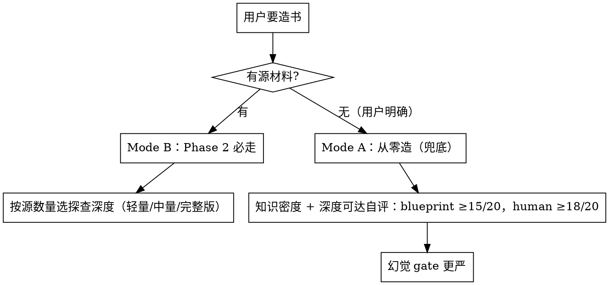

# 源材料处理方法论

> Phase 2（源探查）和 Phase 3.4（章级映射回填）的方法学。

---

## 〇、Mode A/B 决策流程图

> 不要因为"手头暂时没找到源"就跳去 Mode A——先穷尽找源（学生用书 + 教师用书优先）。

---

## 一、源角色标签（7 类）

用户给的所有素材文件都在 META.md 正文的"源材料"小节里登记（自然语言描述即可，不需要 yaml），每个文件打一个角色标签。角色标签决定该文件在写作中的地位。

| 角色标签 | 什么文件 | 在写作中的地位 |
|---|---|---|
| `student_textbook` | 学生用书 PDF/MD | 教学主线骨架 |
| `teacher_textbook` | 教师用书 PDF/MD | 差异比对 + 教学方法补充 |
| `syllabus` | 考纲/ECO/课程标准 | 覆盖校验基准（启用 syllabus 覆盖校验时必备） |
| `authoritative_source` | 权威原文（PMBOK/法典/官方指南/Scrum 指南） | 防幻觉真相源，冲突裁决最高级 |
| `teaching_notes` | 教学笔记/讲义/精炼笔记 | 教学骨架与例子，条目化起点 |
| `reference` | 辅助参考（博客/旧版/碎片化资料） | 仅在恰好覆盖时辅助，不作骨架 |
| `ocr_fragment` | OCR 碎片（宝典/扫描残片） | 最低等级，不作骨架 |

任意组合都合法：
- 师生合版 = `[student_textbook, teacher_textbook]`
- 单教材 = `[student_textbook]`
- PMP 多源 = `[syllabus, authoritative_source×3, teaching_notes×5, ocr_fragment×1]`

---

## 二、两层索引方法学

### 第一层：源级探查（Phase 2 必走）

所有有源书都走 Phase 2，深度按源数量自度。产出：
1. **源文件简码表**（简码/路径/定位/权威层级）
2. **真相校准**：实际翻源文件，识别"看起来完整其实是碎片"的坑（如 OCR 碎片被误认为完整骨架）
3. **全书通用锚点**：跨章共享的源定位（公式汇总表/原则全文位置/术语表位置）

三档深度：
- **轻量**（单教材）：只建简码表+通用锚点，不做章级预映射
- **中量**（师生合版或 2-3 份异构源）：简码表+通用锚点+教师用书独有内容粗比对
- **完整版**（≥4 份异构源或有 syllabus 的认证类）：简码表+通用锚点+每源结构探查+真相校准+高频陷阱预判

### 第二层：章级映射回填（Phase 3.4 做）

Phase 3.4 定章后，为每章回填：
1. 章→源文件行号映射（精确到段落）
2. 预抽关键条目（硬记锚/公式/术语）
3. 高频陷阱/偏好预判
4. 写作惯例（最佳范例章后回填）

### 不要在 Phase 2 硬建章级映射
此时还没有章，硬建只会对空构造。章是 Phase 3 设计的产物，映射跟着章走。

---

## 三、师生合版独有内容比对

有 `teacher_textbook` 角色标签时，在 Phase 2 做教师用书独有内容比对：
1. 逐单元对比学生用书和教师用书
2. 教师用书独有内容分类：评价标准/教学目标/学情分析/常见错误/考点提示/深层知识讲解
3. 比对结果写入源材料索引第一层的"教师用书独有内容"小节，供 Phase 3 设计板块语法时取用（如 teacher_textbook 的"常见错误"直接对应 misconception 模式卡）

不产出独立 DIFF-STUDENT-TEACHER.md 文件——结果入源材料索引。

---

## 四、Mode A（无源从零造）选题前自评（知识密度 + 深度可达）

用户明确"什么源都没有"时走 Mode A，选题前过两道 gate：

1. **知识密度**：AI 就本书覆盖的 20 个核心锚点各写一段解释。有明显犹豫/错误/幻觉的锚点超过 3 个 → 建议用户找源或换领域。
2. **深度可达**：对最核心的 3 个概念，各写一段"给内行看的 200 字讲解"，用 `references/depth.md` 判定问题评估：
   - 至少达到「机理 + 任选一维」两维（Phase 3.1 未定侧重前用"任选一维"暂定）→ 深度可达
   - 三个样张都停在"是什么"级（百科式浅层）→ 选题前建议用户找源或换领域
3. **通过门槛**：知识密度达标 AND 深度可达，两项齐备才放行。

通过自评后：
- human-readable 路线需知识密度 ≥18/20 + 用户明示接受幻觉风险
- pure-blueprint 路线需知识密度 ≥15/20
- I2（断言可追溯）替代机制：每个断言必须通过 L5 路径 B/C 的学员验证
